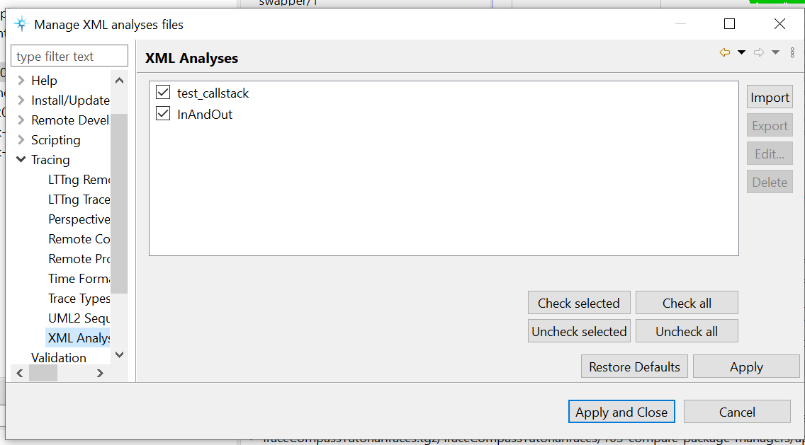
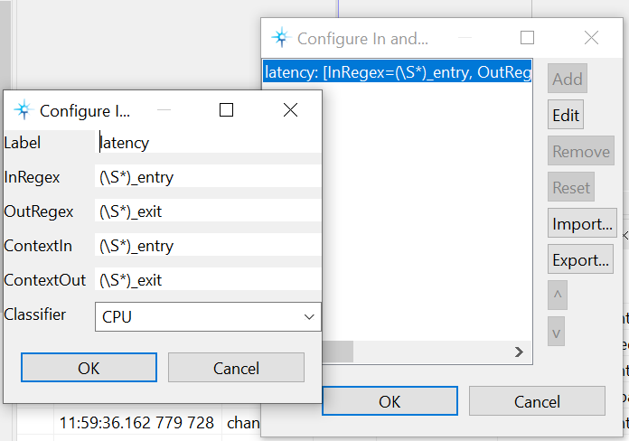
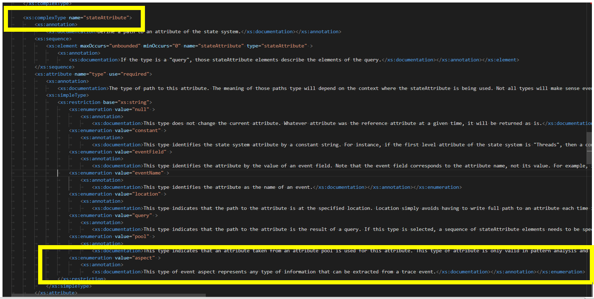
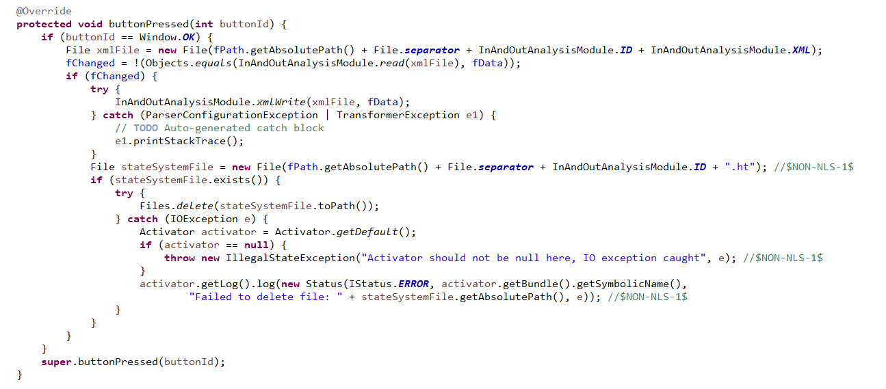

# 1. Investigation: replace in and out logic with xml file

Date: 2023-03-01

## Status

Proposed

## Context

A [previous patch][configure] added the options to import and export a JSON configuration file for
the front-end. Now this ADR is about changing the back-end logic for In-and-Out to implement
XML-based analysis support.

At the moment these analysis settings are saved internally in a JSON file, based on custom logic.
The latter would then benefit from being replaced with reuse of XML-based analysis logic. This
would reduce the overall maintenance burden, while making UX more familiar to Trace Compass users.

## Decision

### Proposed change

The suggestion to improve the logic of the In and Out analysis is to revise the function that saves
the file internally, to save an XML file instead of a JSON file. This improved functionality would
make it possible to upload the XML directly into the XML manager analyses page:

From the investigation done, the steps below would need to be implemented:

#### 1.Adding missing aspect in XSD document

When creating a new configuration setting in the in and out analysis (as per picture below), one of
the preferences named `Classifier` is related to the aspect of that setting (example: CPU, event
type).

At the moment, there is no possibility from the actual enumeration of the `stateAttribute` to
select the `aspect`. Therefore, in the section `complexType` named `stateAttribute` of the
`xmlStateProvider.xsd` file, an additional enumeration needs to be added. The new enumeration may
be named `aspect` and can be associated to the `classifier`:

#### 2.Saving the XML

The `buttonPressed` method in the `InAndOutConfigDialog` class needs to be revised: the structure
of the code needs to be adapted to generate a file with XML extension and to write an XML file
(method `xmlWrite`).

In `InAndOutAnalysisModule`, a new `xmlWrite` method needs to be added. This new method is to
replace the previous write logic inside the `buttonPressed` method, per the picture above. The
`xmlWrite` method would need to generate a structure that matches the XML file in the following
Gerrit change: [Replace In and Out logic with XML file][replace].

**n.b.** The code that generates the XML in the `xmlWrite` method, in the commit mentioned above,
is just a basic prototype to test how to create an XML file. More complex code and structure need
to be written, in order to achieve the correct XML file format that will be compatible with XSD
validation at the next step.

#### 3.Registering the XML

For the XML to be registered, Incubator needs to call an API from Trace Compass to request/gain
access to the `loadXmlFile` method (`XMLAnalysesManagerPreferencePage` class), related to loading
XML into the XML manager.

## Consequences

Changing the internal saving process would make the XML-analysis integration possible and this
should improve the product. It would make the logic easier to maintain/validate and more user
friendly.

[configure]: https://git.eclipse.org/r/c/tracecompass.incubator/org.eclipse.tracecompass.incubator/+/199565
[replace]: https://git.eclipse.org/r/c/tracecompass.incubator/org.eclipse.tracecompass.incubator/+/199830
